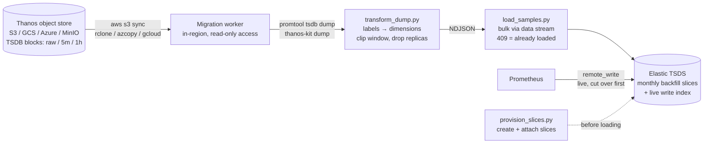

# Thanos → Elastic: metrics history migration kit

**Migrate historical Prometheus metrics out of Thanos into Elastic
time series data streams — then retire Thanos and its infrastructure.**

Blocks are read **directly from the object-store bucket** — no Thanos
component sits in the data path (only the compactor must be stopped first).
Examples use AWS S3, but any Thanos object-store backend works (GCS, Azure Blob,
MinIO/S3-compatible, …); only the copy client changes.

Prometheus metrics, logs, and APM traces end up in one platform with one
query surface (PromQL included), and the long-term retention that justified
running Thanos moves to Elastic's cold/frozen tier. The historical backfill
— the hard part, since a TSDS normally refuses any document older than a few
hours — is solved here with a **verified, idempotent recipe** proven against
Elasticsearch 9.1.3 and 9.5.3.

---

## Why this exists

| | Before | After |
|---|--------|-------|
| Live metrics | Prometheus → Thanos sidecar/receive | Prometheus → Elastic (native remote_write) |
| Long-term retention | Thanos compactor + store gateways + S3 | Elastic TSDS on cold/frozen tier |
| Metrics queries | PromQL via Thanos Query | PromQL in Kibana / ES\|QL `TS` |
| Logs ↔ metrics ↔ traces correlation | Two systems, manual | One platform |
| Thanos infrastructure | Queriers, store gateways, compactor, receiver | **Retired** (S3 bucket kept as rollback artifact) |

## The core problem, in one error message

```
400 timestamp_error: the document timestamp [2025-09-04T12:00:00.000Z] is outside
of ranges of currently writable indices [[2026-09-04T07:15:25Z, 2026-09-04T09:45:25Z]]
```

A time series data stream only accepts writes within ~2.5 hours of *now*
(configurable to at most 7 days). Twelve months of history can never enter
through a default-configured cluster. Two verified solutions:

- **Path A (Elasticsearch 9.5+, recommended)** — configure cluster setting
  `data_stream.past_tsdb_index_creation_enabled: true` (plus
  `data_streams.past_tsdb_index_interval: 7d` to control slice width) and
  Elasticsearch creates past backing indices automatically as historical
  documents arrive, via both the bulk API and the native Prometheus
  remote_write endpoint. ILM origination dates are set automatically, and
  the feature is GA on Serverless.
- **Path B (< 9.5)** — pre-create monthly `time_series` indices with explicit
  `start_time`/`end_time`, attach them to the live data stream, then
  bulk-write through the data stream name.

Either way, duplicate samples come back as 409s (TSDS derives `_id` from
dimensions + timestamp), making every load safely re-runnable.

> Acronym note: **TSDS** (time series data stream) is the Elastic destination;
> **TSDB** refers to Prometheus's storage engine — the blocks in the Thanos
> bucket. Elastic's Path A setting names happen to say `tsdb`; they are
> reproduced verbatim because the API requires the exact name.

## Pipeline



## Repository map

| Path | What it is |
|------|-----------|
| **[RUNBOOK.md](RUNBOOK.md)** | End-to-end procedure: AWS + Elastic prerequisites, IAM policy, script input reference, per-block export loop, validation, ILM, decommission, rollback |
| **[FINDINGS.md](FINDINGS.md)** | The evidence: every experiment, every error hit during trial-and-error, the 9 gotchas, the 9.1.3 vs 9.5.3 version matrix, the PromQL parity results, and the throughput benchmark |
| [`poc/provision_slices.py`](poc/provision_slices.py) | Creates monthly backfill slice indices (mappings cloned from the live write index, bounds clamped against live data) and attaches them to the data stream. Idempotent |
| [`poc/transform_dump.py`](poc/transform_dump.py) | `promtool tsdb dump` / `thanos-kit dump` text → load-ready NDJSON. Drops Thanos replica labels, clips to time windows, skips staleness markers, never silently loses data |
| [`poc/load_samples.py`](poc/load_samples.py) | Bulk loader targeting the data stream name. Treats 409 as "already ingested" → crash-safe resume by re-running. Includes a `--synthetic` generator for testing |
| [`poc/remote_write_probe.py`](poc/remote_write_probe.py) | Sends samples (including historical timestamps) to the native `/_prometheus/api/v1/write` endpoint — hand-encoded remote_write protobuf, stdlib only |
| [`poc/parity_check.py`](poc/parity_check.py) | The migration sign-off gate: sends the **identical PromQL query** to Prometheus/Thanos Query and to ES's native `/_prometheus` API (or ES\|QL `TS` for custom schemas), compares bucket-for-bucket, fails on >5% divergence |
| [`poc/estimate_migration.py`](poc/estimate_migration.py) | Wall-clock + storage predictor: feed it the sample counts from `thanos tools bucket inspect` and it applies benchmark-calibrated stage rates to estimate duration and identify the bottleneck |
| [`slides/thanos-to-elastic-migration.pptx`](slides/thanos-to-elastic-migration.pptx) | Customer-facing deck: the before/during/after story with the verified proof points ([`build_deck.js`](slides/build_deck.js) regenerates it) |

All scripts are Python 3 stdlib only — nothing to install. Authentication
via the `ES_API_KEY` environment variable.

## Quick start (local reproduction)

```bash
# 1. Elasticsearch in Docker
docker run -d --name es-tsds-poc -p 9200:9200 \
  -e discovery.type=single-node -e xpack.security.enabled=false \
  -e ES_JAVA_OPTS="-Xms1g -Xmx1g" \
  docker.elastic.co/elasticsearch/elasticsearch:9.5.3

# 2. Create a Prometheus-style TSDS template + live stream (see FINDINGS.md)

# 3. Path A (9.5+): enable automated past-index creation ...
curl -X PUT localhost:9200/_cluster/settings -H 'Content-Type: application/json' -d '
  {"persistent": {"data_stream.past_tsdb_index_creation_enabled": true,
                  "data_streams.past_tsdb_index_interval": "7d"}}'

#    ... or Path B (<9.5): provision 12 monthly backfill slices instead
python3 poc/provision_slices.py --stream metrics-promtest.node \
    --start 2025-09 --end 2026-09

# 4. Load a year of synthetic samples through the data stream (either path)
python3 poc/load_samples.py --stream metrics-promtest.node --synthetic \
    --series 8 --interval 900 \
    --from 2025-09-01T00:00:00Z --to 2026-09-01T00:00:00Z

# 5. Query 12 months + live data as one continuous stream
curl -s -XPOST localhost:9200/_query?format=txt -H 'Content-Type: application/json' -d '
  {"query": "FROM metrics-promtest.node | STATS c=COUNT(*) BY m=DATE_TRUNC(1 month, @timestamp) | SORT m"}'
```

## Verified results

- ✅ **280,320 samples** across 12 monthly slices loaded at **~60k docs/s**
  (single-threaded, laptop) — every document routed to the correct slice
- ✅ **Idempotent at full scale**: replaying all 280,320 docs →
  `created=0 duplicate=280320 failed=0`
- ✅ One ES|QL query spans backfilled + live data with no visible seam
- ✅ On 9.5.3, `TS … | STATS SUM(RATE(counter))` returns **numerically
  exact** rates from backfilled counter data
- ✅ Identical behavior on Elasticsearch 9.1.3 and 9.5.3
- ✅ **9.5 automated backfill (Path A)**: 280k-doc year with zero
  provisioning, 56 auto-created weekly indices, ILM origination dates set
  automatically — and the blog's setting name corrected against the source
- ✅ **Native remote_write endpoint accepts 12-month-old samples** once
  Path A is enabled (HTTP 204, past index auto-created); duplicates return
  HTTP 400 partial-failure, so bulk remains the backfill loader of choice
- ✅ **PromQL parity validated with the real toolchain**: real TSDB blocks
  (`promtool create-blocks-from`, incl. a counter reset) served by a real
  Prometheus vs the same blocks migrated to ES — with the **identical PromQL
  text on ES's native `/_prometheus` API**, gauges are bit-identical
  (0.0000%) and `rate()` agrees to ≤0.25%
- ✅ **Migrate into the native `metrics-*.prometheus-*` schema**: the
  built-in template auto-types counters by naming convention and dimension-
  maps labels — no custom template, and dashboards keep PromQL verbatim
- ✅ **Year-over-year comparisons work**: `offset 341d` queries (values,
  `avg_over_time`, `rate`) verified against year-old migrated data —
  matching real Prometheus exactly; only single-expression cross-offset
  ratios (`x / x offset 1y`) are not yet supported in the tech preview
  (use two overlaid panel queries instead)
- ✅ Shard budget measured (~52 weekly indices/year/stream on Path A) with
  verified mitigations: force-merge works on auto-created past indices,
  ILM ages them via `origination_date`

## Status & open items

- ⚠️ ILM must be applied explicitly to Path B slices (Path A handles it via
  `origination_date` automatically)
- ⚠️ Final sign-off on the customer's own data: run `poc/parity_check.py`
  with `--prom` pointed at their Thanos Query for 3–5 dashboard-critical
  metrics — default mode sends the identical PromQL to both engines
  (runbook step 4)
- ⚠️ Audit exporters for Prometheus **native histograms** before migrating —
  the dump transform rejects them explicitly; classic histograms are fine
- ⚠️ No query migration needed for dashboards (PromQL runs natively). One
  semantic surprise applies only to *newly written* native ES|QL: inside the
  `TS` command, a bare `AVG(gauge)` is an implicit `last_over_time` (the
  bucket's last sample), not a window average — use
  `AVG(AVG_OVER_TIME(field))` for the PromQL-equivalent result. See gotcha
  #9 in the [FINDINGS.md gotchas table](FINDINGS.md)
