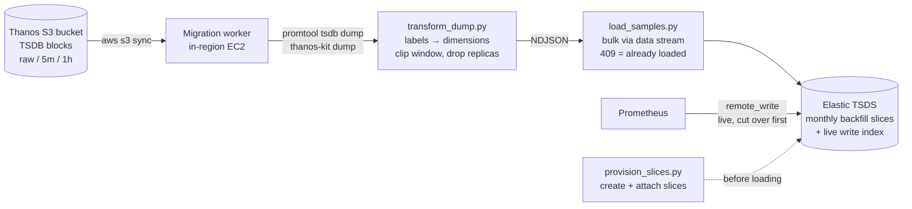

# Thanos → Elastic: metrics history migration kit

**Migrate 12+ months of Prometheus metrics out of Thanos (S3) into Elastic
time series data streams — then retire Thanos and its infrastructure.**

Prometheus metrics, logs, and APM traces end up in one platform with one
query surface (PromQL included), and the long-term retention that justified
running Thanos moves to Elastic's cold/frozen tier. The historical backfill
— the hard part, since a TSDS normally refuses any document older than a few
hours — is solved here with a **verified, idempotent recipe** proven against
Elasticsearch 9.1.3 and 9.5.3.

---

## Why this exists

| | Before | After |
|---|--------|-------|
| Live metrics | Prometheus → Thanos sidecar/receive | Prometheus → Elastic (native remote_write) |
| Long-term retention | Thanos compactor + store gateways + S3 | Elastic TSDS on cold/frozen tier |
| Metrics queries | PromQL via Thanos Query | PromQL in Kibana / ES\|QL `TS` |
| Logs ↔ metrics ↔ traces correlation | Two systems, manual | One platform |
| Thanos infrastructure | Queriers, store gateways, compactor, receive | **Retired** (S3 bucket kept as rollback artifact) |

## The core problem, in one error message

```
400 timestamp_error: the document timestamp [2025-09-04T12:00:00.000Z] is outside
of ranges of currently writable indices [[2026-09-04T07:15:25Z, 2026-09-04T09:45:25Z]]
```

A time series data stream only accepts writes within ~2.5 hours of *now*
(configurable to at most 7 days). Twelve months of history can never enter
through remote_write or a naive bulk load. The recipe: pre-create monthly
`time_series` indices with explicit `start_time`/`end_time`, attach them to
the live data stream, then bulk-write **through the data stream name** —
Elasticsearch routes every document to the right slice by timestamp, and
duplicate samples come back as 409s, making every run safely re-runnable.

## Pipeline



## Repository map

| Path | What it is |
|------|-----------|
| **[RUNBOOK.md](RUNBOOK.md)** | End-to-end procedure: AWS + Elastic prerequisites, IAM policy, script input reference, per-block export loop, validation, ILM, decommission, rollback |
| **[FINDINGS.md](FINDINGS.md)** | The evidence: every experiment, every error hit during trial-and-error, the 7 gotchas, and the 9.1.3 vs 9.5.3 version matrix |
| [`poc/provision_slices.py`](poc/provision_slices.py) | Creates monthly backfill slice indices (mappings cloned from the live write index, bounds clamped against live data) and attaches them to the data stream. Idempotent |
| [`poc/transform_dump.py`](poc/transform_dump.py) | `promtool tsdb dump` / `thanos-kit dump` text → load-ready NDJSON. Drops Thanos replica labels, clips to time windows, skips staleness markers, never silently loses data |
| [`poc/load_samples.py`](poc/load_samples.py) | Bulk loader targeting the data stream name. Treats 409 as "already ingested" → crash-safe resume by re-running. Includes a `--synthetic` generator for testing |

All scripts are Python 3 stdlib only — nothing to install. Authentication
via the `ES_API_KEY` environment variable.

## Quick start (local reproduction)

```bash
# 1. Elasticsearch in Docker
docker run -d --name es-tsds-poc -p 9200:9200 \
  -e discovery.type=single-node -e xpack.security.enabled=false \
  -e ES_JAVA_OPTS="-Xms1g -Xmx1g" \
  docker.elastic.co/elasticsearch/elasticsearch:9.5.3

# 2. Create a Prometheus-style TSDS template + live stream (see FINDINGS.md)

# 3. Provision 12 months of backfill slices and attach them
python3 poc/provision_slices.py --stream metrics-promtest.node \
    --start 2025-09 --end 2026-09

# 4. Load a year of synthetic samples through the data stream
python3 poc/load_samples.py --stream metrics-promtest.node --synthetic \
    --series 8 --interval 900 \
    --from 2025-09-01T00:00:00Z --to 2026-09-01T00:00:00Z

# 5. Query 12 months + live data as one continuous stream
curl -s -XPOST localhost:9200/_query?format=txt -H 'Content-Type: application/json' -d '
  {"query": "FROM metrics-promtest.node | STATS c=COUNT(*) BY m=DATE_TRUNC(1 month, @timestamp) | SORT m"}'
```

## Verified results

- ✅ **280,320 samples** across 12 monthly slices loaded at **~60k docs/s**
  (single-threaded, laptop) — every document routed to the correct slice
- ✅ **Idempotent at full scale**: replaying all 280,320 docs →
  `created=0 duplicate=280320 failed=0`
- ✅ One ES|QL query spans backfilled + live data with no visible seam
- ✅ On 9.5.3, `TS … | STATS SUM(RATE(counter))` returns **numerically
  exact** rates from backfilled counter data
- ✅ Identical behavior on Elasticsearch 9.1.3 and 9.5.3

## Status & open items

- ⚠️ **Serverless unvalidated** — the recipe relies on index-level settings
  Serverless restricts; confirm the target is Elastic Cloud Hosted or
  self-managed
- ⚠️ ILM must be applied to attached slices explicitly (they never roll over)
- ⚠️ Definitive `rate()` parity check: compare one real migrated month
  side-by-side against Thanos Query before bulk-running the rest
